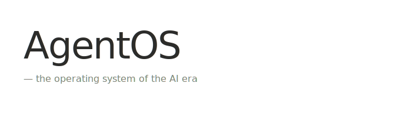
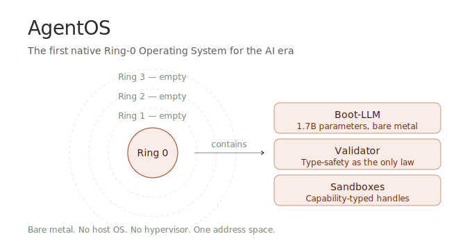
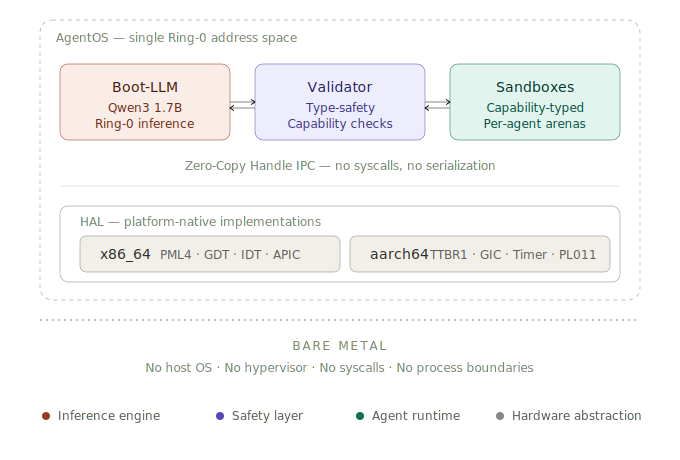
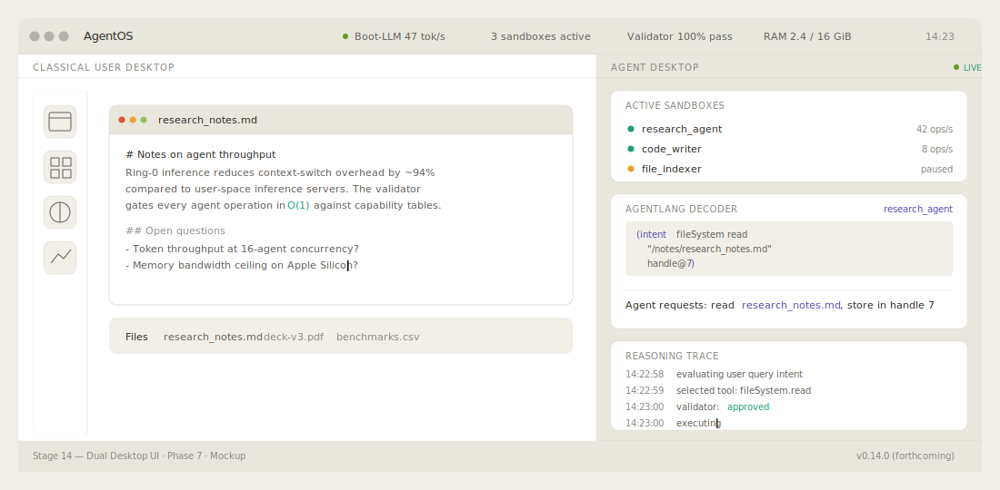
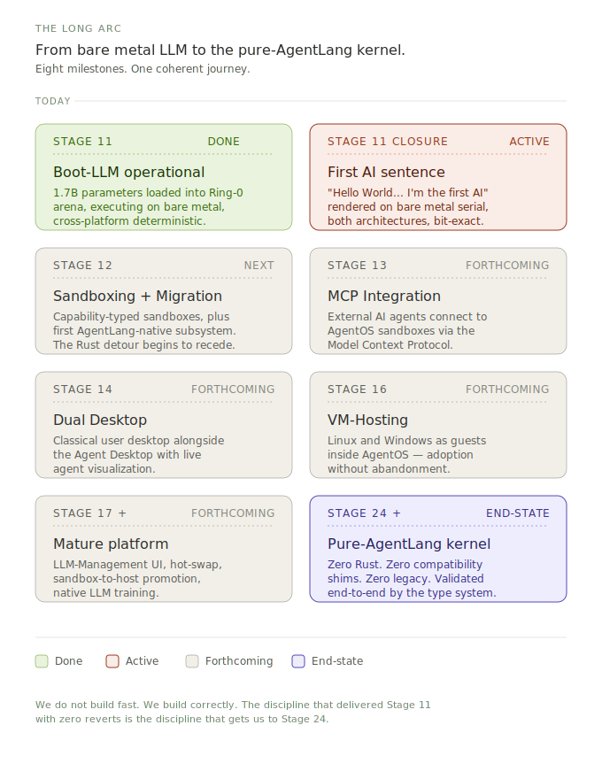
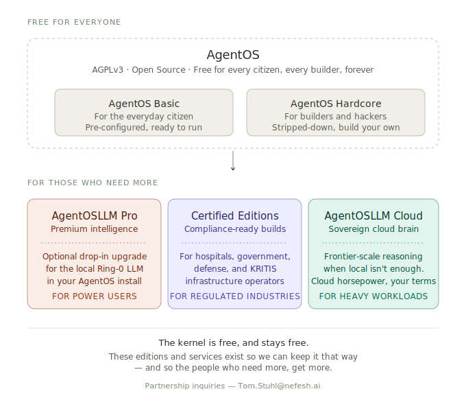

  

  <strong>The first native Ring-0 Operating System built exclusively for the AI era.</strong>

  Executing a 1.7B parameter LLM directly on bare metal (x86_64 &amp; Apple Silicon HVF) with zero host OS overhead.

  
  
  
  
  

---

  

---

## ▶ [WATCH THE DEMO — First AI Words on Bare Metal](#)

> **YouTube link coming soon.** A 1.7-billion-parameter language model, loaded into Ring-0, executing on bare metal across two architectures. No Linux. No Windows. No host OS. Just AgentOS and the model.

---

## AgentOS is Open Source

> The full source code of the kernel will be published to this repository under the **AGPLv3** license. Until then, early source access is restricted to select **design partners and core contributors**.
>
> If you want to be among the first to see the code: email **Tom.Stuhl@nefesh.ai**.

---

## Why This Matters

For 50 years, operating systems have been built for **humans typing into terminals**.

That era is over.

The next operating system has to be built for **agents reasoning, deciding, and acting autonomously** — at machine speed, with deterministic safety, and without the syscall overhead, context switches, and process boundaries that cripple AI workloads on legacy systems.

**AgentOS is that operating system.**

We don't sandbox the AI inside a guest. **The AI is the kernel.**

---

## What We've Already Built

This is not a roadmap. This is **shipped code**.

| Capability | Status |
|---|---|
| **Ring-0 Boot-LLM** (Qwen3-1.7B Q4_K_M) | Executing a 1.7B parameter LLM directly on bare metal |
| **Cross-Platform Determinism** | Bit-exact deterministic output on x86_64 and aarch64 |
| **Apple Silicon HVF Acceleration** | Native ARM64 boot, hardware-accelerated |
| **Unikernel Architecture** | Single Ring-0 address space, zero syscall overhead |
| **AgentLang Validator** | Type-safe code execution, 270+ tests |
| **AOT Compilation** | Native x86_64 codegen, no JIT overhead |
| **Zero-Copy Handles** | Capability-typed inter-component IPC |
| **Arena Allocators** | O(1) bump-pointer, no free-list heap in Ring-0 |

---

## The Architecture

  

**No User-Space.** **No Kernel-Space split.** **No Process Boundaries.** **No Syscalls.**

Safety enforced by the **Validator** and the **type system**, not by hardware page tables.

---

## A Glimpse of the Future — Stage 14 Dual Desktop

  

The classical user desktop runs alongside the **Agent Desktop** — live visualization of running agents, their state, their reasoning, in human-readable form. Every agent intent is decoded into language a human can read and audit. **Pillar 2: Human Oversight** is operationalized at the OS level.

---

## The Long Arc — Roadmap

  

We are at **Stage 11** today. Boot-LLM operational, cross-platform deterministic. **Stage 11 Closure** is active: the first complete AI sentence rendered on bare metal. After that: Sandboxing + AgentLang Migration begins (Stage 12), MCP Integration (13), Dual Desktop (14), VM-Hosting (16), and ultimately the Pure-AgentLang Kernel at Stage 24+.

We do not build fast. We build correctly. The discipline that delivered Stage 11 with zero reverts is the discipline that gets us to Stage 24.

---

## Free for Everyone

  

**The kernel is free, and stays free.** AgentOS Basic for the everyday citizen, AgentOS Hardcore for builders and hackers — both AGPLv3, both forever.

For those who need more — premium intelligence, certified compliance builds for regulated industries, sovereign cloud reasoning — we offer optional editions and services. **These exist so we can keep the kernel free for everyone else.**

Partnership inquiries: **Tom.Stuhl@nefesh.ai**

---

## The Read

If you're an investor, builder, or visionary who wants the philosophy behind why we believe this is the future:

📖 **[Read the Manifesto](MANIFESTO.md)** — The full vision: why classical operating systems are architecturally incompatible with the AI era, and what comes next.

🔒 **For deep technical inquiry** — full architecture specification, decision records, and engineering lessons are available on request to qualified developers, investors, and enterprise partners. Email **Tom.Stuhl@nefesh.ai**.

---

## Get Involved

**Builders:** If you want to contribute at the kernel level, email **Tom.Stuhl@nefesh.ai**. Selected contributors receive access to the full architecture specification.

**Investors:** Email **Tom.Stuhl@nefesh.ai**. We are pre-seed and we know exactly what we're building. The deck is the code.

**Visionaries:** [Read the Manifesto](MANIFESTO.md). If it resonates, share it.

**Press / Analysts:** Email **Tom.Stuhl@nefesh.ai** for technical briefings, demo access, and architectural review materials.

**Enterprise Partners:** Email **Tom.Stuhl@nefesh.ai** for early access to AgentOS Certified Editions design partnerships.

---

## Status

**Stage 11 Phase 4.1 active.** Boot-LLM operational cross-platform. Forward-pass deterministic. ARM-Portierung complete and clean.

**Next milestone:** First complete AI sentence on bare metal — *"Hello World... I'm the first AI"* — both architectures, bit-exact deterministic.

---

## License

[AGPLv3](LICENSE).

The kernel is and remains free. The vision is and remains shared.

---

> *"For 50 years we built operating systems for humans typing into terminals.*
> *AgentOS is built for what comes next."*

— **Tom Stuhl**, Founder, AgentOS
